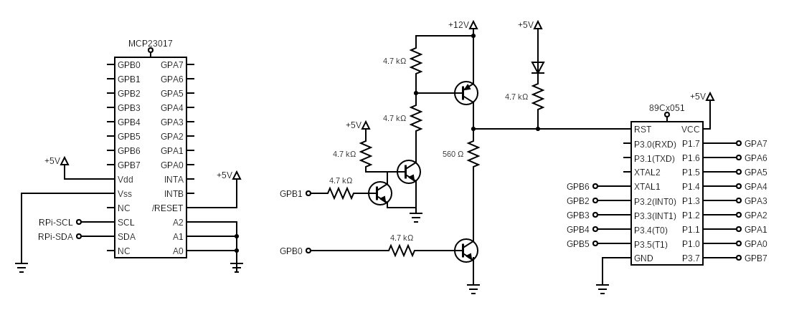
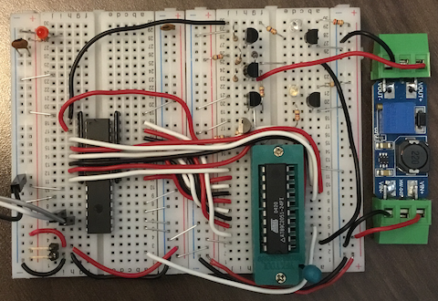

# AT89C2051, AT89C4051 Programmer

Programmer with Raspberry Pi 3 (or above).

Connection
- Raspberry Pi I2C -> MCP23017
- MCP23017 PortA -> 89C2051 P1 for Data
- MCP23017 PortB -> Control signals

