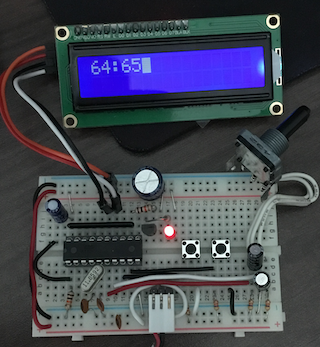

# x051apps

## hello_lcd1602

Simple LCD1602 "hello world" application
- 8 bit mode initialize implementation
- basic LCD1602 control methods

Circuit

## hello_timer

Simple delay with Timer and LED blink

## hello_mcp23017

Software implementation of I2C + MCP23017 LED blink

## hello_lcd1602_i2c

Software implementation of I2C + LCD1602

## hello_switch

Rotary-encoder to INT0 to detect CW/CCW and print to LCD1602

Circuit with x051 + Rotary-encoder + LCD1602 on bread-board

